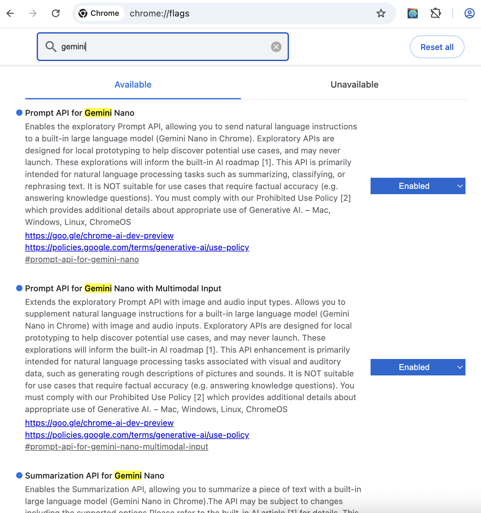
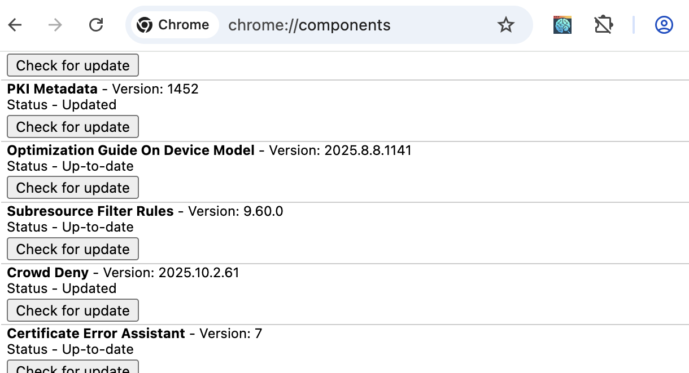
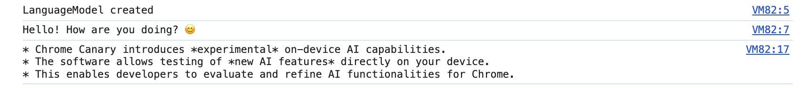

# How to Use Chrome Canary with AI/LLM Features

This extension relies on Chrome’s experimental on‑device AI APIs (Prompt/Language Model and Summarizer). Today, these APIs are available in Chrome Canary and guarded behind feature flags. Follow this guide to install Chrome Canary, enable the LLM features, and verify everything works.

## Why Chrome Canary?

- Experimental AI APIs: The extension uses Chrome’s on‑device AI APIs (Prompt/LanguageModel and Summarizer), which are experimental and ship first in Chrome Canary.
- Local‑first by design: On‑device models keep your browsing data on your computer; no cloud calls are required for core features.
- Rapid updates: Canary receives features and fixes earlier than Stable, which this project depends on.

## 1) Install Chrome Canary

Download and install Chrome Canary from [https://www.google.com/intl/en_ph/chrome/canary/](https://www.google.com/intl/en_ph/chrome/canary/)

- **macOS**: Chrome Canary installs as a separate app alongside regular Chrome
- **Windows**: Chrome Canary installs alongside Chrome Stable
- **Linux**: Canary builds are available via dev/unofficial channels; if unavailable on your distro, use a dev channel build that includes the AI APIs

Tip: Canary uses a separate profile and icon, so it won’t affect your regular Chrome.

## 2) Enable AI/LLM Feature Flags



In Chrome Canary, open `chrome://flags` and search for the following flags. Set each to `Enabled`, then click `Relaunch`.

- Prompt API for Gemini Nano: `chrome://flags/#prompt-api-for-gemini-nano`
- Summarization API for Gemini Nano: `chrome://flags/#summarization-api-for-gemini-nano`
- Optimization Guide on-device model: `chrome://flags/#optimization-guide-on-device-model`

Notes:
- Names may vary slightly across Canary versions. If you can’t find a flag, keep Canary updated and search for “Prompt”, “Summarization”, or “on device model”.
- Enabling these flags allows the on‑device model to be used for text generation and summarization without sending browsing history to the cloud.

## 3) Download the On‑Device Model (Optional but Recommended)



Canary can download the small on‑device model automatically on first use. To ensure it’s available immediately:

1. Open `chrome://components`
2. Find “Optimization Guide On Device Model”
3. Click “Check for update” until it shows “Up‑to‑date”

If you don’t see this component, the model may download the first time an AI API is used.

## 4) Verify AI APIs Work

Open Canary → any page → press `Cmd+Option+J` (macOS) or `Ctrl+Shift+J` (Windows/Linux) to open DevTools Console. Test the APIs.

Try the new global APIs:

```js
// Language model
const lm = globalThis.LanguageModel;
if (lm?.create) {
  const session = await lm.create();
  console.log('LanguageModel created');
  const text = await session.prompt('Say hello in 5 words.');
  console.log(text);
} else {
  console.warn('LanguageModel API not available');
}

// Summarizer
const sum = globalThis.Summarizer;
if (sum?.create) {
  const s = await sum.create();
  const out = await s.summarize('Chrome Canary enables on-device AI features.');
  console.log(out);
} else {
  console.warn('Summarizer API not available');
}
```

If the console prints objects, strings, or prompts for permissions, the APIs are wired up.



## 5) Use the Extension

Once Canary is set up, load the unpacked extension and open the side panel. The app will use on‑device AI for chat and summarization when available.

## Troubleshooting

- LanguageModel/Summarizer is undefined:
  - Recheck flags in `chrome://flags`.
  - Ensure you are actually running Chrome Canary (check `chrome://version`).
  - Update Canary to the latest build.
- Model download pending or slow:
  - Keep Canary open; verify via `chrome://components`.
  - Some networks block component downloads; try a different network.
- Still no luck:
  - Restart Canary after changing flags.
  - As a temporary fallback, the extension will still index and search (text/vector). Chat features require the AI APIs.

## FAQ

- Do I need a Google account? No. On‑device models work without sign‑in. A one‑time download of the model may occur.
- Does my browsing history leave my device? No. The extension is local‑first; the on‑device model runs locally.
- Can I use Stable Chrome? As of October 2025, you cannot use Stable Chrome yet.

